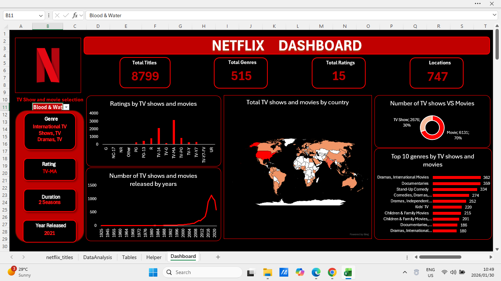

# Excel-Netflix-Dashboard
Developed a dashboard in Microsoft Excel using a Netflix dataset by analysing data with Pivot Tables and presenting insights through charts and graphs.

## Dataset

The Netflix Titles dataset is an instrumental dataset that contains detailed information about the movies and TV shows available on Netflix. It includes details such as the type of title, director, cast, country of production, etc. This dataset shows how content is consumed in different countries overtime and identify popular genre.
The data for this project is sourced from the Kaggle dataset:
- **Dataset Link:** [Netflix Dataset](https://www.kaggle.com/datasets/rahulvyasm/netflix-movies-and-tv-shows)

## Project Overview
- This project involved the analysis of a Netflix dataset using Microsoft Excel to develop an interactive dashboard. 
- The data was explored using PivotTables and advanced Excel functions such as XLOOKUP and IFERROR to enhance accuracy and usability. 
- A searchable drop-down search box with semi-dynamic filtering was implemented to allow users to efficiently navigate the dataset and view insights. 
- Charts and graphs were used to present data visually, enabling quick and effective interpretation.

### Project Overview

## About Me
I am an aspiring data analyst who is proficient in R, SQL, and Excel. This project forms part of my portfolio and highlights the Excel skills required for data analyst roles. 
